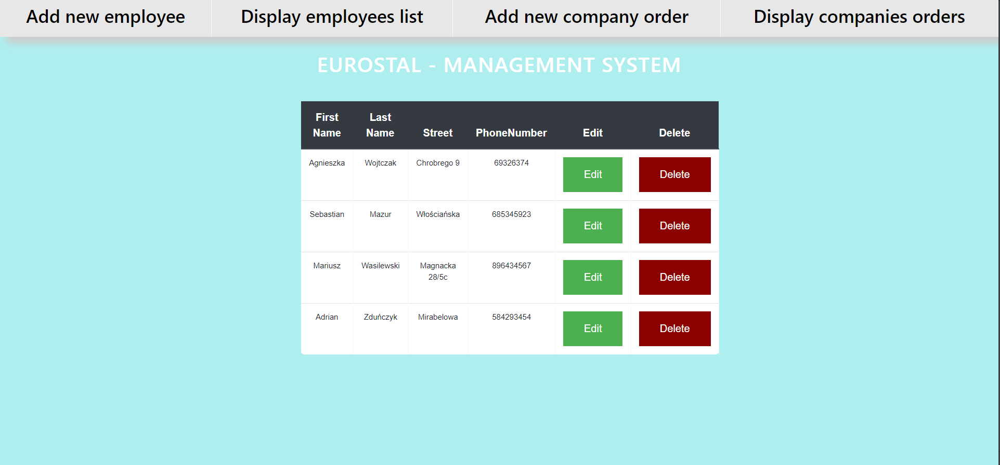

# Company Management System

## Table of Contents
 * [General Information](#general-information)
 * [Technologies](technologies)
 * [Functions](functions)
 * [Screenshots](#screenshots)
 
## General Information

- Hello, during my internship, I noticed that the company's employees often got lost in their data, so I decided to create simple projects based on managing employee data and orders placed by cooperating companies.

## Technologies
- Java
- Spring
- Spring Boot
- Hibernate
- MySql
- Bootstrap
## Functions
- Adding information about an employee
- Adding information about orders placed by cooperating companies
## Screenshots

